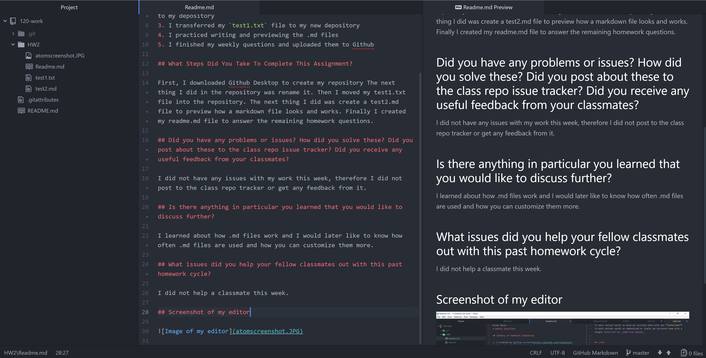

Riley Moser
# Weekly Questions

## Summary of Homework Completion

1. I created my [github account](https://github.com/rileymoser)
2. I downloaded Atom and Github Desktop to write my code and upload it to my depository
3. I transferred my `test1.txt` file to my new depository
4. I practiced writing and previewing the .md files
5. I finished my weekly questions and uploaded them to Github

## What Steps Did You Take To Complete This Assignment?

First, I downloaded Github Desktop to create my repository The next thing I did in the repository was rename it. Then I moved my test1.txt file into the repository. The next thing I did was create a test2.md file to preview how a markdown file looks and works. Finally I created my readme.md file to answer the remaining homework questions.

## Did you have any problems or issues? How did you solve these? Did you post about these to the class repo issue tracker? Did you receive any useful feedback from your classmates?

I did not have any issues with my work this week, therefore I did not post to the class repo tracker or get any feedback from it.

## Is there anything in particular you learned that you would like to discuss further?

I learned about how .md files work and I would later like to know how often .md files are used and how you can customize them more.

## What issues did you help your fellow classmates out with this past homework cycle?

I did not help a classmate this week.

## Screenshot of my editor

