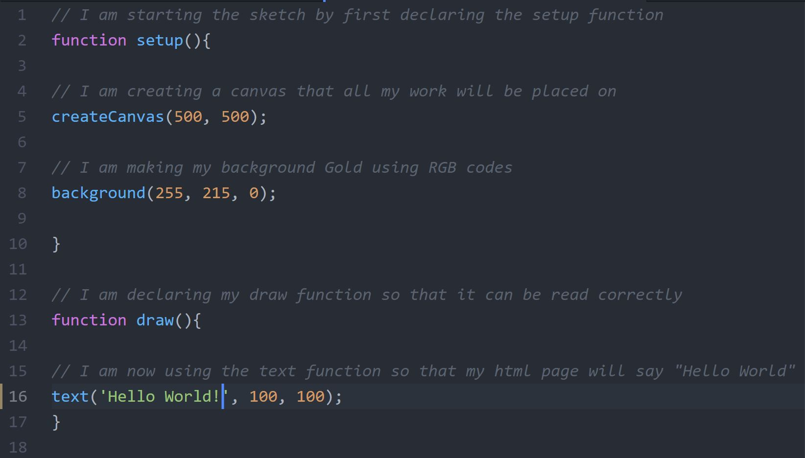

Riley Moser, 50

["Hello World!"](https://rileymoser.github.io/120-work/hw-3/)

# This Week's Work at a Glance

  This week I worked on creating my first `index.html` page while learning more p5 coding. Our first assignment was labeled "Hello World" and had to contain text, a canvas and a background color. Before I started this project I had to first learn how to create a canvas to work on. Then I had to learn how to change background color. To do this you first have to set up the function at the top of the `sketch.js` file by typing in `function setup()`. Then we had to create the canvas by typing `createCanvas()`. In the parenthesis is where you change the pixel dimensions. After that I changed the color of the canvas with the `background()` command. You can use text to change the color of the canvas but I personally used RGB color values for mine. Now that I completed my canvas I moved on to my text. The assignment was labeled "Hello World" so I decided to use that text for my `index.html`. To do this I added a draw function to my sketch. This allowed me to create a text command to add my phrase to the sketch. While I was working on my sketch I was also using comments, which is text that isn't read by the text editor as code. This allows me to keep notes on certain code lines and remember why I used a certain line. After this assignment I feel like I better understand the basics of p5. There were still some problems I ran into. One problem was uploading my sketch to the internet with [Github Pages](https://pages.github.com/). My repository was not organized the right way to open "hw_3" on the internet, so I had to reorganize my whole repository. Some problems I had could've been solved using the class repo issue tracker but I have yet to use that. I am glad to know p5 a little better and am ready to further my knowledge and work in the language.

## Screenshot of my sketch

## Screenshot of my final project

